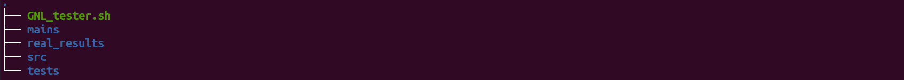

# GNL_tester

This is a tester for the get_next_line project. It only tests the mandatory part of the project.

## Description

**NOTE: This tester functions as a last check for your project. To be a good programmer, you should write your own tests. You can however inspire yourself with the testcases in this tester.**

This tester is based on get_next_line projects that passed Moulinette.<br>
It has a predefined set of tests. The results of your program will be compared to the results in the _real_results/_ directory.<br>
Your project will be tested on some test files which you can find in the _tests/_ directory. For each test file different BUFFER_SIZES will be used.

### Check for memory errors

This tester checks for memory error with AdressSanitizer (ASAN) using the -fsanitize=address flag. You can also use valgrind to check for leaks if this is available on your system. To activate valgrind go into the _GNL_tester.sh_ file and change _valgrind="0"_ to valgrind="1".

## Installation and Usage

Clone this repository. Go into the root folder of the repository and do the following:
```console
mkdir src
```

Copy your source files into the src/ directory. The project tree should look like:<br>



Now run the following command.

```console
./GNL_tester.sh
```
## Support

If you have any questions regarding this tester or you found a bug, you can send an email to hilmiyilmaz.1998@gmail.com with the title _GNL_tester_.

## Contributing

If you have some improvements or more testcases, you can also email me or try to improve yourself.

## License
[MIT](https://choosealicense.com/licenses/mit/)